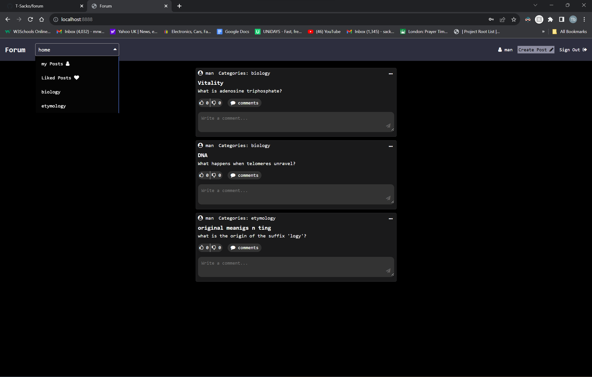

# Forum

## Overview

This forum application allows users to engage in discussions and share their thoughts on various topics. With a user-friendly interface, it provides the following functionalities:

- **Account Creation:** New users can sign up to become a part of the community.
  
- **Create Posts:** Users can start new discussions by creating posts on topics they are interested in.
  
- **Comment on Posts:** Engage in discussions by commenting on posts, sharing views, and responding to other users.
  
- **Like Posts and Comments:** Show appreciation or agreement by liking posts and comments.

## Getting Started

*you will need to have Docker installed and it runs on port 8888*

## Collaborators

 [7Sion7](https://github.com/7Sion7).

<!--## Contributions 

We welcome contributions! If you'd like to contribute, please create a pull request.

## License

*You can mention the license here if you have one.*-->

